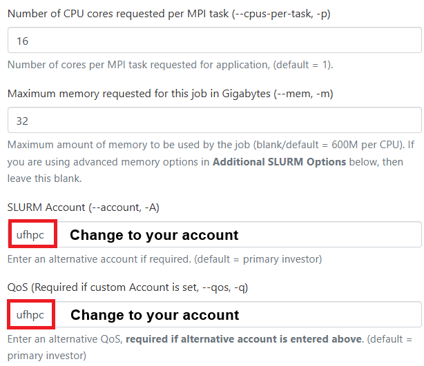
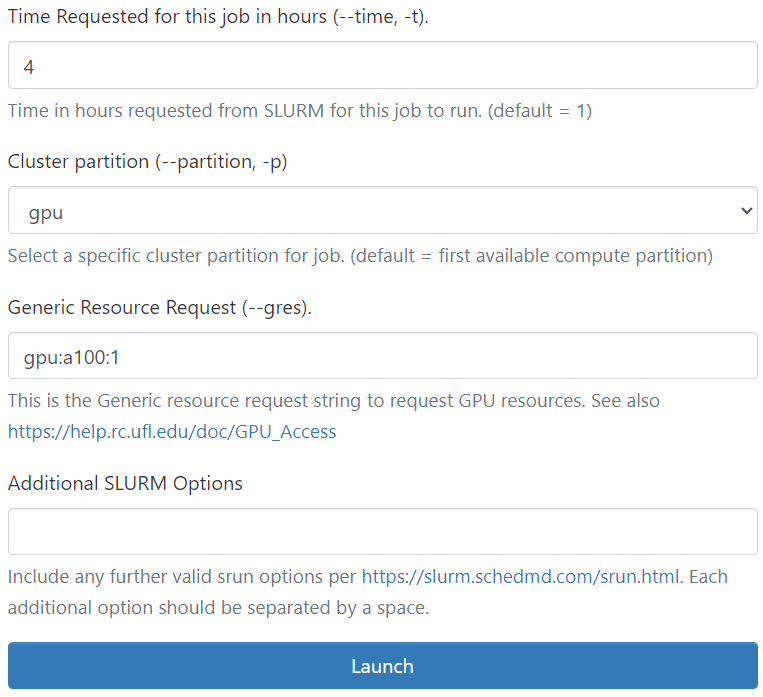
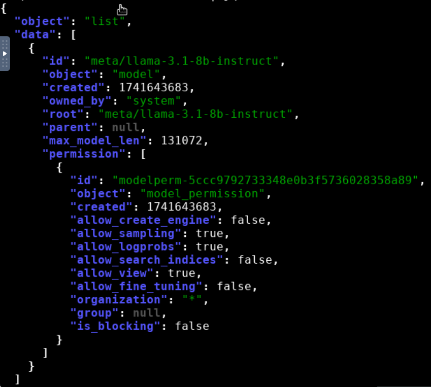
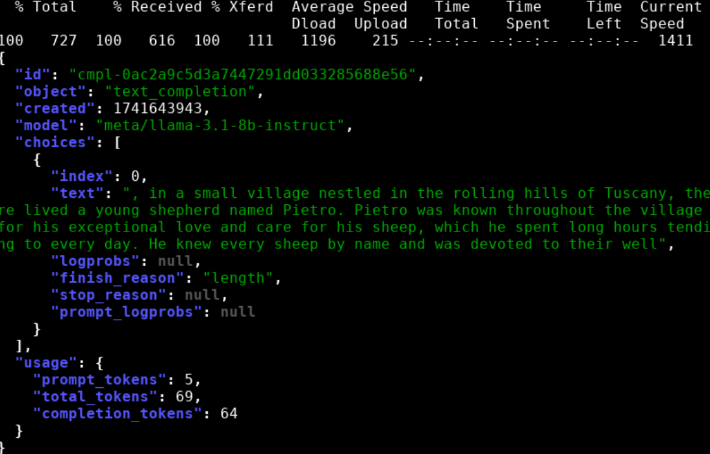
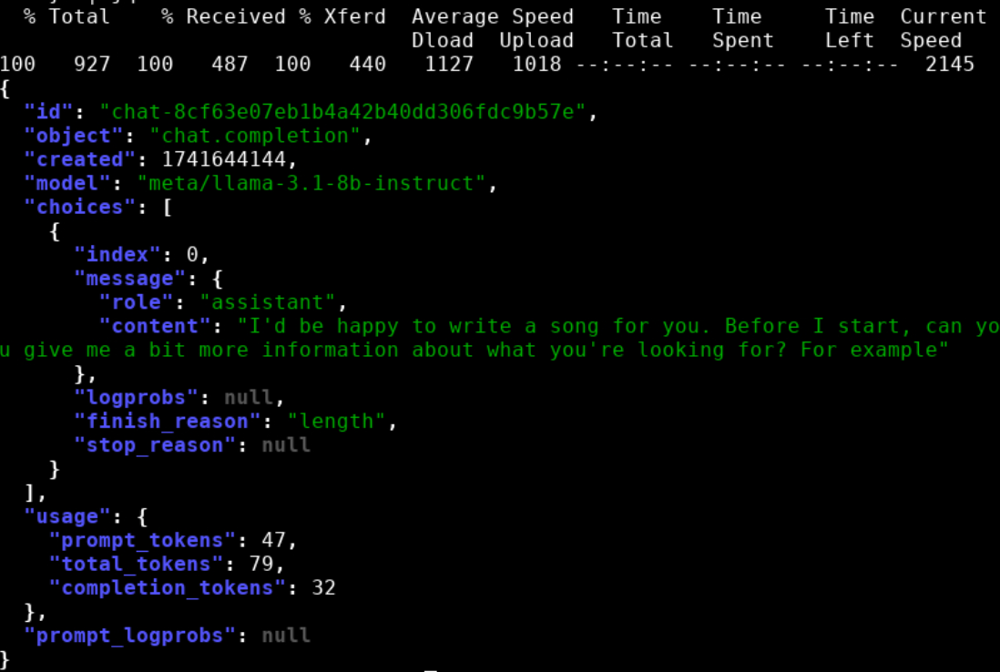

# Llama-3.1-8b-Instruct-NIM

Tutorial to run Llama-3.1-8b-Instruct NIM on HiPerGator

NVIDIA NIM, part of NVIDIA AI Enterprise, is a set of easy-to-use microservices designed to speed up generative AI deployment in enterprises. Supporting a wide range of AI models, including NVIDIA AI foundation and custom models, it ensures seamless, scalable AI inferencing, on-premises or in the cloud, leveraging industry standard APIs.

The Llama 3.1 8B-Instruct NIM simplifies the deployment of the Llama 3.1 8B instruction tuned model which is optimized for language understanding, reasoning, and text generation use cases, and outperforms many of the available open source chat models on common industry benchmarks.

## Prerequisites

- **CPU**:
  - x86 processor with at least 8 cores (modern processor recommended)
  - Memory requirements vary greatly depending on use case. For trtllm_buildable profiles, the memory requirements are approximately equal to the amount of memory used by GPUs.
- **GPU**: 
  - NVIDIA NIM for LLMs should, but is not guaranteed to, run on any NVIDIA GPU, as long as the GPU has sufficient memory, or on multiple, homogeneous NVIDIA GPUs with sufficient aggregate memory and CUDA compute capability > 7.0 (8.0 for bfloat16).

- **model parameters * 2 GB of memory**
  - Llama 8B: ~ 15 GB
  - Llama 70B: ~ 131 GB

These recommendations are a rough guideline and actual memory required can be lower or higher depending on hardware and NIM configuration.

Some model/GPU combinations, including vGPU, are optimized. Refer to Supported Models for further information.

## Launch Llama-3.1-8b-Instruct NIM on HPG

1. Go to [OOD](https://ood.rc.ufl.edu/) and launch the HiPerGator Desktop.
  <p align="center">
  
  
  </p>

  **Note**: Remember to update the `SLURM Account` and `QoS` to match your group, and adjust the **job time** accordingly. 
  
2. Start a terminal and run the following commands:
   ```bash
   mkdir -p /blue/groupname/gatorlink/.cache/nim/llama3.1  # Run only the first time
   export LOCAL_NIM_CACHE=/blue/groupname/gatorlink/.cache/nim/llama3.1
   ml llama-3.1-8b-instruct-nim
   llama-3.1-8b-instruct-nim
   /opt/nim/start-server.sh
   ```

---

## Running Inference

1. **Open a New Terminal**  
   Keep the original terminal running with the launched service.

2. **Navigate to your DESIRED job running directory**
   ```bash
   cd /blue/groupname/gatorlink/...
   ```

3. **Check Service Status**  
   Use the */v1/health/ready* endpoint to properly check if the server is ready to accept inference requests: *curl http://0.0.0.0:8000/v1/health/ready*. The server is ready when this endpoint returns a 200 status code with a success message.
   ```bash
   curl -X GET 'http://0.0.0.0:8000/v1/models'
   ```
   To make the output easier to read, pipe the results of curl commands into a tool like *jq* or python -m json.tool. 
   ```bash
   curl -s http://0.0.0.0:8000/v1/models | jq
   ```
   
   <p align="center">
   
   </p>

4. **OpenAI Completion Request**  
   The Completions endpoint is typically used for base models. With the Completions endpoint, prompts are sent as plain strings, and the model produces the most likely text completions subject to the other parameters chosen. To stream the result, set *"stream": true*.
   ```bash
   curl -X 'POST' \
    'http://0.0.0.0:8000/v1/completions' \
    -H 'accept: application/json' \
    -H 'Content-Type: application/json' \
    -d '{
      "model": "meta/llama-3.1-8b-instruct",
      "prompt": "Once upon a time",
      "max_tokens": 64
    }' | jq
   ```
  <p align="center">
  
  </p>
  
5. **OpenAI Chat Completion Request**
   The Chat Completions endpoint is typically used with chat or instruct tuned models that are designed to be used through a conversational approach. With the Chat Completions endpoint, prompts are sent in the form of messages with roles and contents, giving a natural way to keep track of a multi-turn conversation. To stream the result, set *"stream": true*.
   ```bash
   curl -X 'POST' \
   'http://0.0.0.0:8000/v1/chat/completions' \
    -H 'accept: application/json' \
    -H 'Content-Type: application/json' \
    -d '{
      "model": "meta/llama-3.1-8b-instruct",
      "messages": [
              {
              "role":"user",
              "content":"Hello! How are you?"
          },
          {
              "role":"assistant",
              "content":"Hi! I am quite well, how can I help you today?"
          },
          {
              "role":"user",
              "content":"Can you write me a song?"
          }
      ],
      "max_tokens": 32
    }'
   ```
  <p align="center">
  
  </p>
  
### OpenAI Python API library

1. Set up a Conda environment:
   ```bash
   ml conda
   conda create -n openai python=3.12
   conda activate openai
   conda install requests openai -c conda-forge
   conda install jupyterlab
   conda install ipykernel
   ```
2. Configure the Jupyter kernel:
   ```bash
   cp -r /apps/jupyterhub/template_kernel/ ~/.local/share/jupyter/kernels/openai
   nano ~/.local/share/jupyter/kernels/openai/kernel.json
   ```
   Add the following to `kernel.json`:
   ```json
   {
       "language": "python",
       "display_name": "openai",
       "argv": [
           "~/.local/share/jupyter/kernels/openai/run.sh",
           "-f",
           "{connection_file}"
       ]
   }
   ```

3. Create the `run.sh` script:
   ```bash
   nano ~/.local/share/jupyter/kernels/openai/run.sh
   ```
   Add the following content (do not forget change to your own dir):
   ```bash
   #!/usr/bin/bash
   exec /blue/groupname/gatorlink/conda/envs/openai/bin/python -m ipykernel "$@" 
   ```

4. Satrt the JupyerLab server on Desktop
   
   Open a new terminal and run the command:
   ```bash
   conda activate openai
   jupyter lab
   ```
   After launching JupyterLab, ensure you select the 'openai' kernel before running the notebook [01_inference.ipynb](01_inference.ipynb).
   
## Stopping the NIM Service

To stop the NIM service, simply close the terminal window.

## References

- [Llama-3.1-8b-Instruct Documentation](https://docs.nvidia.com/nim/large-language-models/latest/getting-started.html)
- [Llama-3.1-8b-Instruct on NVIDIA NGC](https://catalog.ngc.nvidia.com/orgs/nim/teams/meta/containers/llama-3.1-8b-instruct)
- [Conda and Jupyter Kernels Setup](https://github.com/magitz/conda_Jupyter_kernels)

---
   
